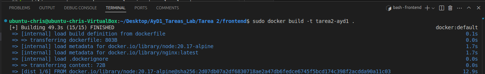

# Creacion de proyecto con react + vite

utilizamos el siguiente comando donde:
frontend: es el nombre elegido para el proyecto

```bash
npm create vite@latest frontend -- --template react-ts
```

Entramos a la carpeta frontend e instalamos dependencias:

```bash
cd frontend/
npm install
```

Instalamos Boostrap en el proyecto:

```bash
npm install bootstrap
```

Codificar la vista en el archivo src/App.tsx

# Archivo dockerfile

```bash
# Usa una imagen oficial de Node.js como imagen base
FROM node:20.17-alpine AS dist

# Establece el directorio de trabajo
WORKDIR /react-front

# copiar el archivo package.json y package-lock.json
COPY package*.json ./

# Instala las dependencias
RUN npm install

# Copia el resto de la aplicación
COPY . .

# Construye la aplicación para producción
RUN npm run build

# Usa una imagen oficial de Nginx como imagen base para servir la aplicación
FROM nginx AS prod-stage

# Copia los archivos de la aplicación construida
COPY --from=dist /react-front/dist /usr/share/nginx/html
# Copia la configuración de Nginx
COPY --from=dist /react-front/default.conf /etc/nginx/conf.d/

# Expone el puerto 80
EXPOSE 80

# Inicia Nginx
CMD ["nginx", "-g", "daemon off;"]
```

# Construir la imagen de Docker

ubicado en la raiz del proyecto (frontend) ejecutar:

```bash
sudo docker build -t <nombre_usuario_dockerhub>/<nombre_imagen> .
```

donde:

<nombre_usuario_dockerhub> es nuestro usuario de docker Hub

<nombre_imagen> es el nombre que le queremos poner a la imagen.

para mi caso en especifico:

```bash
sudo docker build -t chriscobar/tarea2-ayd1 .
```

Si no quiero subirlo a docker hub no es necesario poner el nombre de usuario.

utilizare este comando ya que lo ejecutare localmente.

```bash
sudo docker build -t tarea2-ayd1 .
```



ver la imagen creada correctamente:

```bash
sudo docker images
```


# Ejecutar el contenedor

Para probar la aplicacion en el contenedor ejecutar:

```bash
sudo docker run -d -p 80:80 --name t2-ayd1 tarea2-ayd1
```

Aquí:

-d ejecuta el contenedor en segundo plano.

-p 80:80 mapea el puerto 80 del contenedor al puerto 80 de la máquina.

--name t2-ayd1 le da un nombre al contenedor.

tarea2-ayd1 es el nombre de la imagen que creada.

Para ver nuestro contenedor si esta en funcionamiento:

```bash
sudo docker ps
```


# Verificacion de funcionamiento en puerto 80


